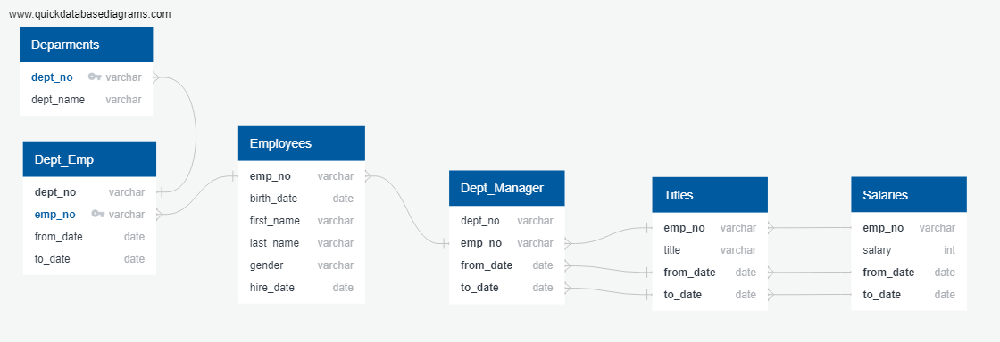

# Pewlett-Hackard-Analysis

Pewlett-Hackard is looking for the future of the operations with a focus on the employees that are about to retire and impact that these invaluable people will have. PH engaged a team to create a database and analyse the data from 6 different tables. To improve reliability of the data and provide future analysis, the team decided to handle the data using *Postgres* and *PgAdmin4*.

Six different tables were create based on the files provided. Theses tables are the core of the whole analysis and the correlation between tables can be found on the figure below. The employees that are about to retire were filtered based on their birth date between *1952* and *1955*, as the employees list contain all employees that were hired and the ones that left the company, the list had to be reviewed few times and the same filter was used on several other tables. When considering the number of employees that will retire and their respective titles, an additional analysis had to be performed and partitioning the data was performed to remove any duplicated data (people that had a promotion during the their time at PH would have more that on entry)

Several other tables were created with relationships from the base 6 tables, from these tables is possible to say that there are ***33,118*** employees that are on the age to retire, representing **14%** of total active employees. These employees that about to retire will be missed on several departments, especially on Production and Development where the number of retirees will be close to *10,000 people*.
In order to avoid a *“Silver Tsunami”*, the managers from the Sales and Development departments are joining forces to bring some of the more experienced staff that are not about to retire, but are not far from, to create a mentorship program to guide new and existing employees to fill these positions.

Pewlett-Hackard is starting late this type of analysis, however it is on the right track to avoid bumps on the way and continue growing business without compromising quality of its products.
